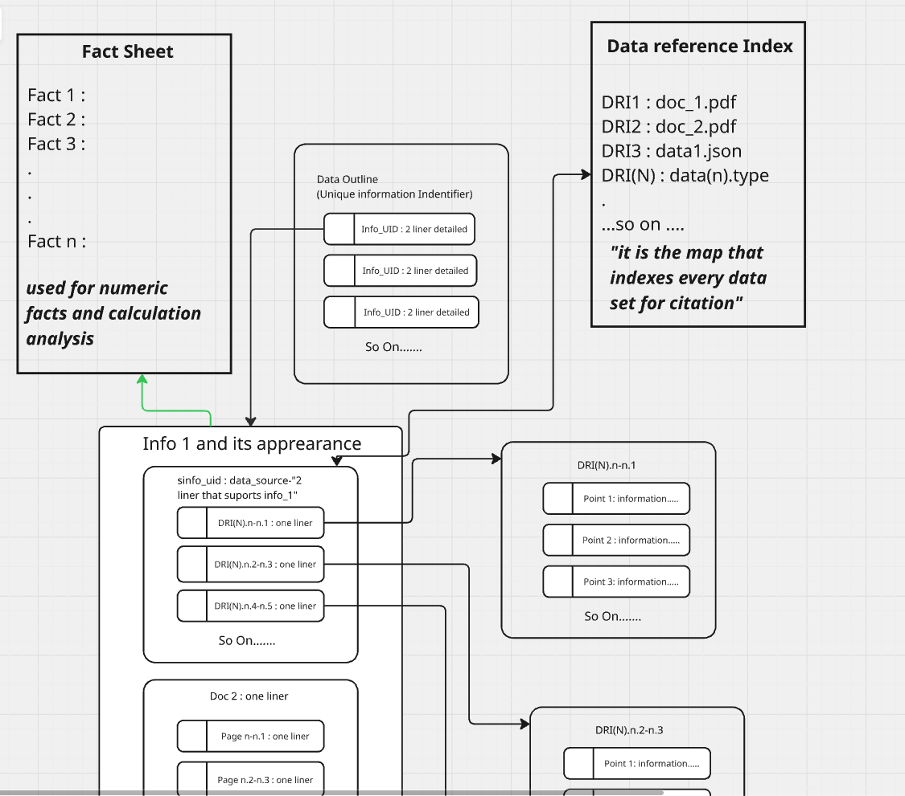

# Information Relation Index (IRI)

A full-stack prototype that explores **concept-first retrieval** instead of chunk-first RAG.

This is a personal project (v0.1). It is working software you can run locally — not a production system. The goal is to separate *what a document says* (exact stored text at a fixed coordinate) from *how you find it* (vector search over short concept summaries, then a graph lookup).

---

## The idea

Most RAG systems work like this:

1. Split documents into chunks
2. Embed the chunks
3. On a query, find similar chunks
4. Pass those chunks to an LLM

That works for demos, but the retrieved chunks are treated as if they *are* the answer. Similarity is not proof. Two conflicting documents can both rank highly, get merged in the prompt, and the model can blend them or invent a middle ground. Citations are often approximate.

IRI tries a different shape:

| Layer | What it stores | Role |
|---|---|---|
| **Document (DRI)** | A registered file (PDF, text, etc.) | Physical source — gets a number like `DRI1`, `DRI2` |
| **Granular point** | A paragraph of verbatim text | Exact evidence at a coordinate like `DRI1.3-3.2` (document, page, point) |
| **Concept (Info_UID)** | A short two-line summary of an idea | Abstract label — e.g. "IP ownership on company hardware" |
| **Appearance (sinfo_uid)** | A link from one concept to specific points in one document | Same idea can appear in multiple documents as separate branches |

**Vector search does not return evidence.** It only picks which concept summaries are closest to the query. After that, the system walks a Neo4j graph to find the exact PostgreSQL rows and returns the stored text.

The LLM (Gemini) is used in three places, and all of them can fail or vary between runs:

- **Extraction** — reads uploaded files and proposes concepts + facts
- **Embeddings** — turns queries and summaries into vectors
- **Answer synthesis** (optional) — writes a short answer using only retrieved evidence, with inline `[DRI#.#-#.#]` citations

If Gemini is unavailable or rate-limited, extraction falls back to a simple rule-based splitter, and answers fall back to listing retrieved excerpts directly.

---

## Visual walkthrough

These four diagrams show the data model and query flow the project is built around.

### 1. High-level outline

The full stack: documents are ingested into PostgreSQL and Neo4j; queries route through concepts to evidence; the frontend visualizes the path.



### 2. After ingestion — concepts linked to source points

Once a file is uploaded and processed, Gemini (or the fallback extractor) assigns concepts to specific numbered points in the document. Each concept gets two summary lines used later for vector search.


### 3. How indexing is represented in the graph

During indexing, the system records a traversal path: `Info_UID` → `APPEARS_AS` → appearance node → granular point coordinates. Neo4j holds this routing structure; PostgreSQL holds the actual text.


### 4. Query result with a provenance path

When you ask a question, the UI lights up the path from the matched concept down to the evidence coordinates that backed the response. Citations point to real stored text, not to embedding scores.


---

## What is actually built

### Backend (Python / FastAPI)

- **PostgreSQL + pgvector** — stores documents (`data_references`), verbatim text (`granular_points`), typed facts (`facts`), concept embeddings (`concept_search_projections`), ingestion jobs, and a graph outbox table
- **Neo4j** — stores concept nodes and `APPEARS_AS` edges to appearance nodes (point IDs and coordinates only — no raw text in the graph)
- **Alembic migrations** — schema including append-only triggers on the document ledger and granular points
- **Ingestion API** — register or upload a file; extraction runs as a background `asyncio` task inside the API process (max 2 concurrent jobs)
- **Retrieval API** — streams NDJSON events: `route` → `evidence` or `fact` → `answer` → `done`

### Frontend (Next.js + Three.js)

- Force-directed graph visualization
- File upload (PDF, JSON, CSV, Markdown, TXT)
- Chat panel that streams retrieval events and highlights the graph path for each citation
- Proxies API calls through `/api/dri/*` so the browser does not need direct backend access

### Tests

- ~18 backend unit tests (schema validation, citation checking, file parsing)
- ~5 frontend unit tests
- No end-to-end tests against live PostgreSQL/Neo4j in CI yet

---

## Ingestion flow (what happens when you upload a file)

1. File bytes are saved locally and registered in PostgreSQL as a new DRI entry (`DRI1`, `DRI2`, …).
2. The file is split into **granular points** — paragraphs from PDF pages or text blocks (see `src/iri/extraction/files.py`).
3. **Gemini** (`gemini-2.0-flash`) proposes concepts (name + two summary lines + which points support them) and optional typed facts. If no API key is set, a deterministic fallback creates one concept per point.
4. Concept IDs are derived from a normalized concept name (`uuid5`). Same name → same ID across uploads. Different wording → different concepts (this is simple, not robust deduplication).
5. Summary embeddings are stored in PostgreSQL (`gemini-embedding-001`, 1536 dimensions).
6. Concept and appearance nodes are written to Neo4j.
7. The concept's `is_routable` flag is set to `true` only after the graph write completes, so retrieval skips half-indexed concepts.

**Note:** The codebase also defines an `ExtractionBundle` contract in `docs/extraction-contract.md` for a future worker-based design. The current ingestion path calls Gemini directly and does not use that bundle yet.

---

## Retrieval flow (what happens when you ask a question)

### Evidence mode (default)

1. **Route** — embed the query; find nearest routable concept summaries via pgvector cosine distance.
2. **Resolve** — for each matched concept, read `APPEARS_AS` edges in Neo4j to get point IDs.
3. **Fetch** — load verbatim text from PostgreSQL by point ID. Each point has a coordinate like `DRI3.1-1.4`.
4. **Answer** — optionally call Gemini to synthesize a response from the retrieved text. The backend rejects answers that cite coordinates not present in the retrieved evidence. If generation fails, it returns an extractive fallback (quoted excerpts with coordinates).

### Fact mode (`mode=facts`)

Same routing step, then returns typed fact rows from PostgreSQL (numbers, dates, text) linked to source points, instead of raw paragraph evidence.

---


## Getting started

### Prerequisites

- Python 3.12+
- Docker & Docker Compose (or Podman)
- Node.js 20+
- A [Gemini API key](https://aistudio.google.com/app/apikey) — optional for extraction/answers (fallbacks exist), required for embeddings at query time

### Backend

```bash
cp .env.example .env
# Set GEMINI_API_KEY in .env

python3 -m venv .venv
source .venv/bin/activate
make install

make infra-up       # PostgreSQL (pgvector) + Neo4j
make migrate
make graph-schema

make dev            # API at http://localhost:8000/docs
```

### Frontend

```bash
cd frontend
cp .env.local.example .env.local   # if present; defaults proxy to localhost:8000
npm install
npm run dev                        # UI at http://localhost:3000
```

Upload a file in the UI, wait for the job to reach `complete`, then ask a question in the chat panel.

---

## API endpoints

| Method | Endpoint | Description |
|---|---|---|
| `POST` | `/v1/ingestions` | Register a source URI. Returns `202` with a job ID. Requires `Idempotency-Key` header. |
| `POST` | `/v1/ingestions/upload` | Upload a file and start extraction. Supported: PDF, JSON, CSV, Markdown, TXT. |
| `GET` | `/v1/ingestions/{job_id}` | Job status: `queued`, `processing`, `complete`, or `failed`. |
| `POST` | `/v1/retrieval/stream` | Stream NDJSON: `route` → `evidence`/`fact` → `answer` → `done`. Use `mode=facts` for typed facts. |
| `GET` | `/health/live` | Process is running. |
| `GET` | `/health/ready` | PostgreSQL and Neo4j are reachable. |

---

## Project layout

```
src/iri/          FastAPI app, extraction, retrieval, DB models
frontend/         Next.js UI with graph visualization
migrations/       Alembic schema
tests/            Backend unit tests
docs/             Architecture notes and extraction contract (partially aspirational)
```

---

## Further reading

- [`docs/architecture.md`](docs/architecture.md) — schema invariants and design intent (some items describe target architecture, not all are implemented as separate services yet)
- [`docs/extraction-contract.md`](docs/extraction-contract.md) — planned worker hand-off format
- [`frontend/README.md`](frontend/README.md) — frontend-specific setup and event types

---


