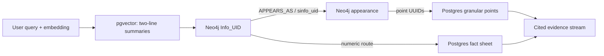

# Architecture and invariants

## Hard invariants

1. Every physical source receives one database-generated DRI number.
2. DRI and granular-point rows are append-only; corrections produce new rows.
3. A point coordinate is unique on `(dri_id, page_start, page_end, point_number)`.
4. Vector columns contain only approved `Info_UID` summaries.
5. Every fact points to one granular point and carries exactly one typed value.
6. Neo4j stores PostgreSQL identifiers, never raw evidence or fact values.
7. Graph writes originate in the PostgreSQL outbox. Search projections remain
   non-routable until their graph events have been applied.
8. Online retrieval emits source evidence/facts and hashes, not unsupported prose.

## Consistency boundary

PostgreSQL is the transaction coordinator. An extraction transaction writes
points, facts, concept search projections, and graph outbox events together. A
projector applies outbox events idempotently to Neo4j. Once all events for an
`Info_UID` are published, it sets the search projection's `is_routable` flag.
This explicit activation gate prevents retrieval from observing half a graph.

## Operational security

Production credentials should be split by role:

- API: read retrieval tables; insert DRI and ingestion jobs.
- Extractor: insert points, facts, projections, and outbox events.
- Graph projector: claim outbox rows, write Neo4j, activate projections.
- Migrator: DDL only; never used by a running service.

The migration installs append-only triggers on the physical ledger and granular
points. Encryption, backups, row-level tenant isolation, and secret management are
deployment responsibilities and should be added before hosting customer data.

